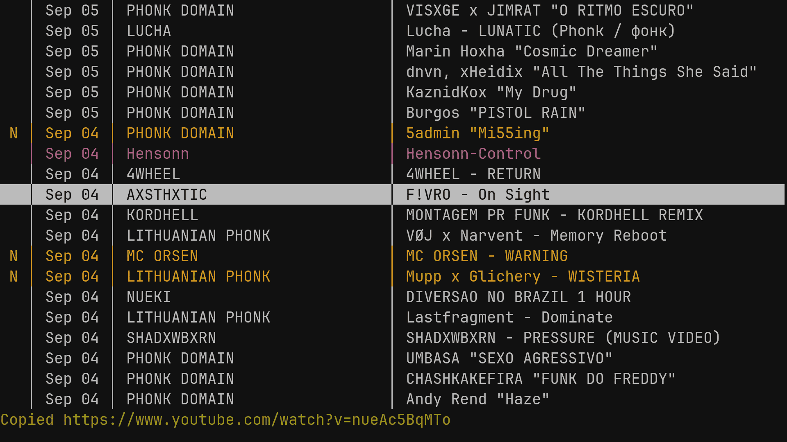

## Description

Newsraft is a [feed reader](https://en.wikipedia.org/wiki/News_aggregator) with
[ncurses](https://en.wikipedia.org/wiki/Ncurses) user interface. It is greatly
inspired by [Newsboat](https://www.newsboat.org) and tries to be its lightweight
counterpart. The design differences between these projects are mentioned in the
[doc/project-goals.md](https://codeberg.org/grisha/newsraft/src/branch/main/doc/project-goals.md).

## Dependencies

| Name                                                               | Version   | Necessity              |
|--------------------------------------------------------------------|-----------|------------------------|
| [curl](https://curl.se)                                            | >= 7.87.0 | required               |
| [expat](https://github.com/libexpat/libexpat)                      | >= 2.4.8  | required               |
| [gumbo](https://github.com/google/gumbo-parser)                    | >= 0.10.1 | required               |
| [ncursesw](https://invisible-island.net/ncurses)                   | >= 6.2    | required               |
| [sqlite](https://www.sqlite.org)                                   | >= 3.36.0 | required               |
| [yajl](https://github.com/lloyd/yajl)                              | >= 2.1.0  | required               |
| C compiler                                                         | Any C99   | required at build-time |
| make                                                               | Any POSIX | required at build-time |
| [pkg-config](https://www.freedesktop.org/wiki/Software/pkg-config) | >= 0.29.2 | optional at build-time |
| [scdoc](https://git.sr.ht/~sircmpwn/scdoc)                         | >= 1.9.1  | optional at build-time |

## Installing

Some package repositories have Newsraft package so it can be installed with a
package manager.

If your package repository doesn't provide Newsraft package, you can build it
from source. Detailed instructions for different platforms are described in
[doc/build-instructions.md](https://codeberg.org/grisha/newsraft/src/branch/main/doc/build-instructions.md).

## Learning more

The essential source of information about Newsraft is its man page. If you've
built Newsraft from source with scdoc dependency, the man page should've been
generated in the project directory. Alternatively, you can try to read
[doc/newsraft.scd](https://codeberg.org/grisha/newsraft/src/branch/main/doc/newsraft.scd)
scdoc file which is the recipe for generating this man page.

Examples on how to configure Newsraft are located in the
[examples](https://codeberg.org/grisha/newsraft/src/branch/main/examples)
directory.

## Contributing

Reporting bugs: [doc/contributing-report.md](https://codeberg.org/grisha/newsraft/src/branch/main/doc/contributing-report.md)

Making changes: [doc/contributing-change.md](https://codeberg.org/grisha/newsraft/src/branch/main/doc/contributing-change.md)

## Copying

Newsraft is distributed under the terms of the
[ISC license](https://codeberg.org/grisha/newsraft/src/branch/main/doc/license.txt).
